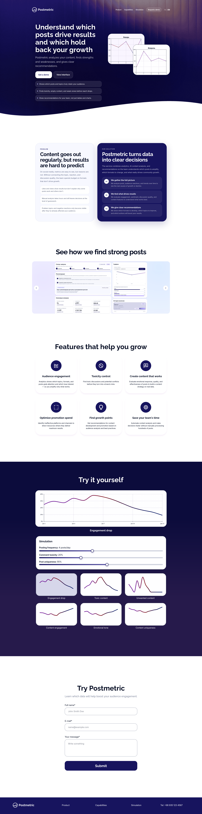

# Postmetric

A landing page for Postmetric — a social media analytics project.



## About

Postmetric helps you analyze the effectiveness of your posts:

- AI-powered social media analysis
- Statistics visualization
- Recommendations for improving your content
- History of analyzed statistics
- Export results as JSON

The project consists of two parts:

- `frontend` — a React/Vite application with an interactive chart and a lead form
- `backend` — a Go API for receiving and viewing requests, with SQLite storage and Google Sheets integration

## Tech Stack

**Frontend:** React, TypeScript, Vite, Tailwind CSS, Recharts  
**Backend:** Go, SQLite, Google Sheets Webhook  
**Infrastructure:** Docker, Docker Compose, Nginx

## Project Structure

```text
Postmetric/
├── frontend/
├── backend/
├── docker-compose.yaml
└── README.md
```


## Local Setup (without Docker)

### 1) Backend

```bash
cd backend
go mod download
```

Create a `backend/.env`:
```env
PORT=3000
CLIENT_URL=http://localhost:5173
SHEETS_URL=https://script.google.com/macros/s/.../exec
ADMIN_USER=user
ADMIN_PASS=password
```

Run the server:
```bash
go run main.go
```

The backend will be available at `http://localhost:3000`.

### 2) Frontend
```bash
cd frontend
npm install
npm run dev
```

The frontend will be available at `http://localhost:5173`.

For local development, create a `frontend/.env` file:
```env
VITE_API_URL=http://localhost:3000
```

## Running with Docker Compose
```bash
docker compose up --build
```

Once running:
- Frontend: `http://localhost`
- API: `http://localhost/api/*`

## API (backend)
- `POST /requests` — create new request
- `GET /requests` — list all requests
- `GET /requests/:id` — get a request by ID